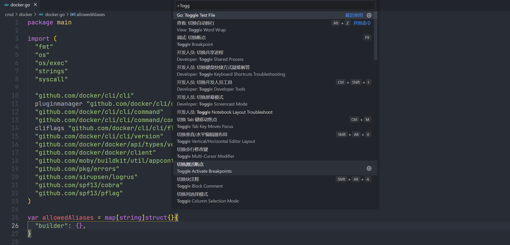
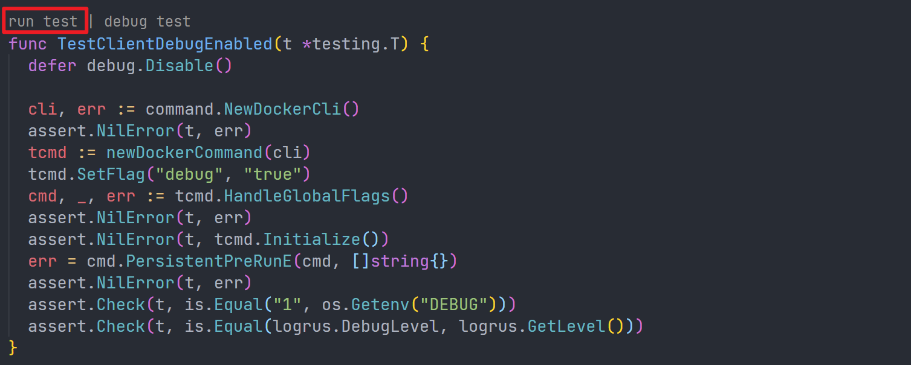
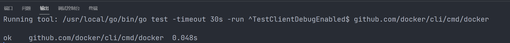
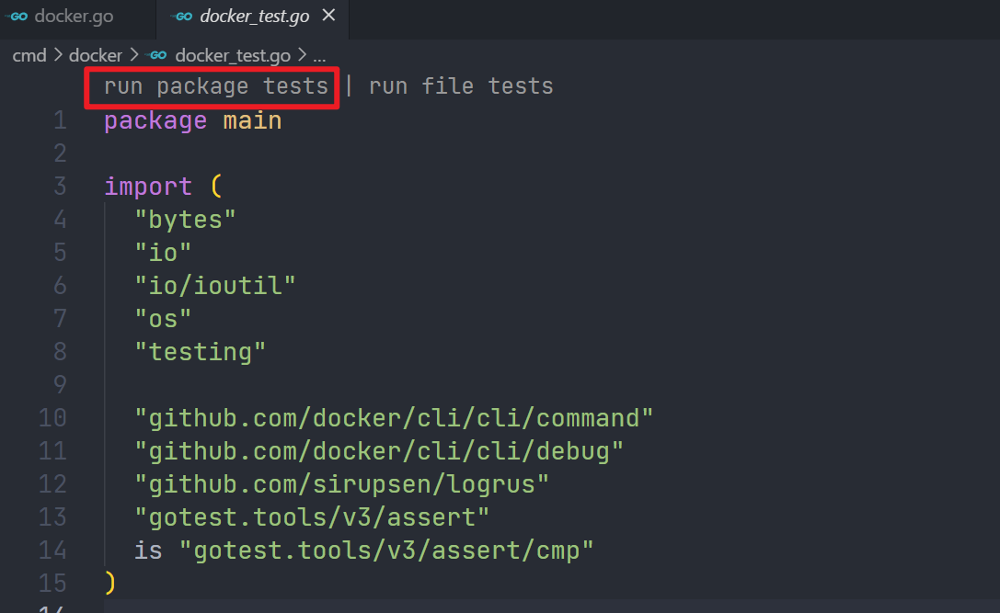
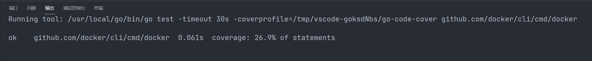
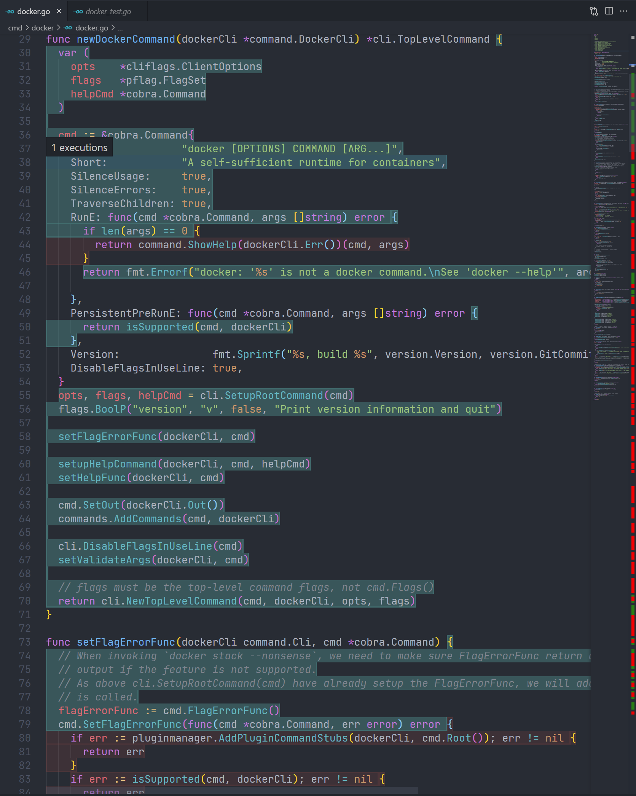

# 了解 Go 单元测试

## 单元测试

单元测试是指对软件中的最小可测试单元进行检查和验证。这个最小可测试单元在实际编码过程中可大可小。一个完整的项目一定是包括了完善的单元测试。像 Docker 这种项目自然也包括了一批的单元测试代码。

单元测试其实很简单，就是分两步，第一步执行代码获取输出，第二步检验输出是否符合预期。使用伪码表示如下

```python
result = func(arg1, arg2, arg3)
assert.equal(result, '预期结果')  # 如果 result 为 '预期结果' 那么测试通过。
```

单元测试是一个功能十分强大的质量保障工具，对内为代码的输入输出负责，通过校验代码执行的输入输出构建一个强壮的验证环境，如果单元测试写得完整，无论多大规模的重构都不会影响到核心功能；对外为第三方开发者提供完善的用例信息，一份完善的单元测试代码和测试用例对于开发者来说比一份几百页的说明书还好用。

对于一个有相对完整的单元测试的开源项目，要了解代码的功能，查阅单元测试代码是非常有必要的。通过单元测试为入口引导阅读代码比直接干啃源码也会简单的多。

## VSCode 集成的 Go 测试功能

在这里会以 docker-cli 的 `cmd/docker/docker.go` 这个源代码为例，来展示 VSCode 集成的 Go 测试功能。其对应的单元测试文件就是 `cmd/docker/docker_test.go`。在 VSCode 上可以在打开 `cmd/docker/docker.go` 的时候使用快捷键 `ctrl + shift + p`，然后输入 `toggle  test`，直接跳转到单元测试文件。



在 `cmd/docker_test.go` 文件中找`TestTestClientDebugEnabled` 方法，然后点击 `run test` 即可完成单个测试方法。



执行完成之后就能够在 `输出` 中查看结果



## 通过 package test 查看测试覆盖率

在 `cmd/docker_test.go` 文件的顶部可以看到一个 `run package tests` 



点击后，将会对整个 package 进行测试并输出测试覆盖率



重新打开 `cmd/docker.go` 被测 package 代码，可以看到编辑器已经把被测代码和未测试代码着色。在重要功能被测试覆盖的情况下这个功能能够用于快速找到关键代码，避免处理编辑情况的代码干扰。

