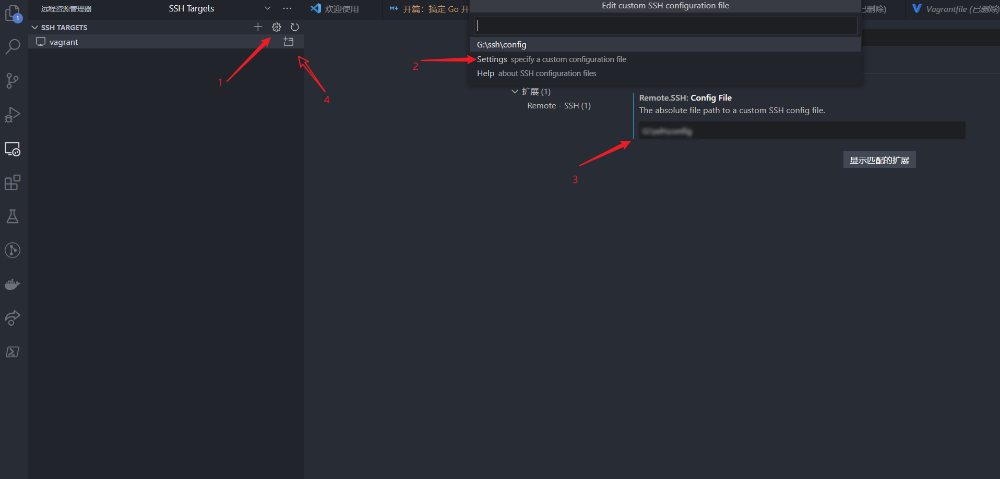
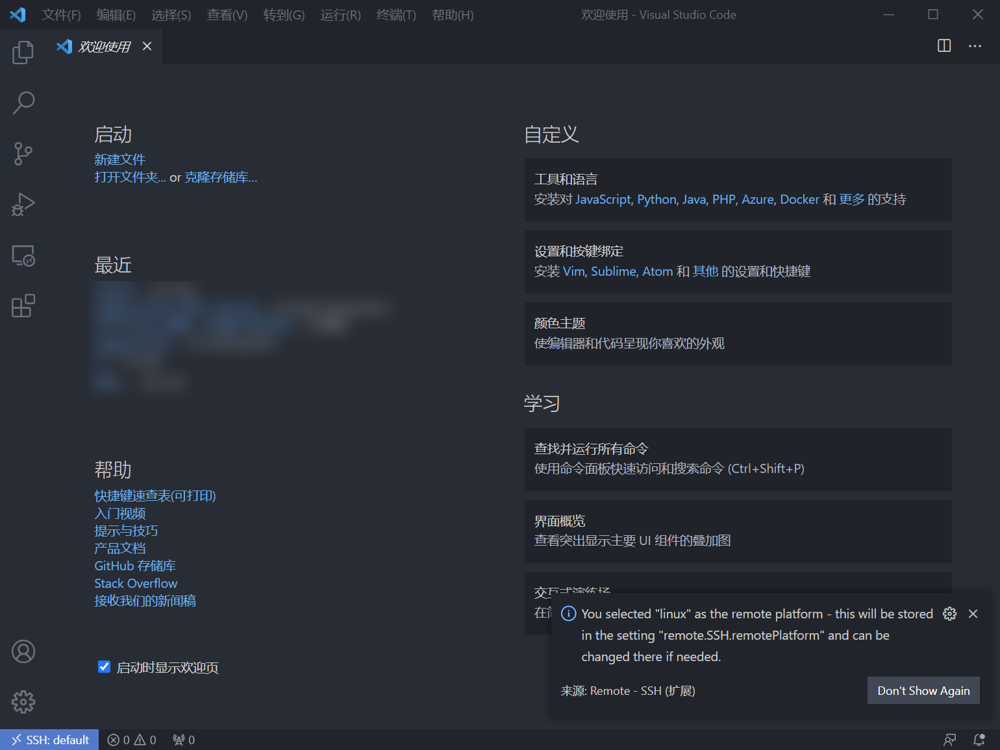
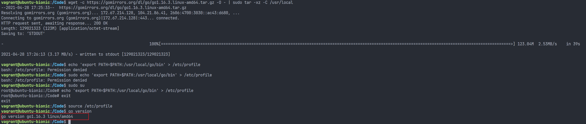
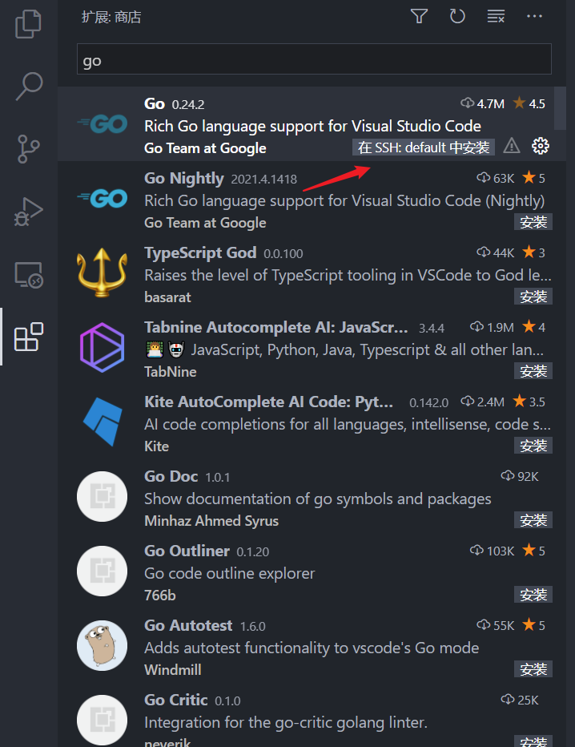
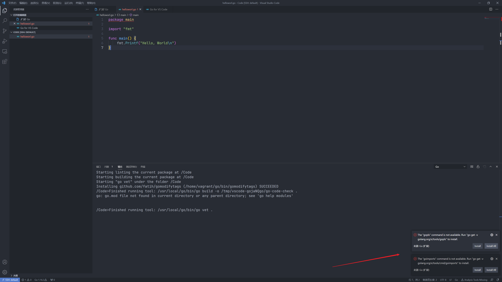
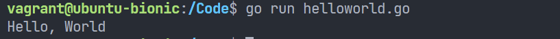

# 开篇：搞定 Go 开发环境

开门见山，搞定一个合乎心意的 Go 开发环境一定要包括一个简单的 Linux 开发环境来适配生产环境，一个称心的编辑器/IDE来编写代码，一个 Go 代理屏蔽糟糕的国内网络环境。

在开篇我会使用 Vagrant 来创建一个简单的 Linux 虚拟机，然后使用 VS Code 作为编辑器，使用 Go Proxy 来对 Go 进行加速代理，最终完成 Go `Hello world` 的编写

## 使用 Vagrant 搞定 Linux 虚拟机

Linux 可以说是世界上使用最广泛的服务器平台，众多服务器应用和工具也是围绕 Linux 进行开发，所以我们一定要使用 Linux 作为我们的开发环境。从接触编程开始我就在选择快速的创建 Linux 虚拟机的方法。后面接触到了 Vagrant，通过 Vagrant 无须操作复杂的虚拟化软件界面，仅靠一个 Vagrantfile 就能够快速的创建一个 Linux 虚拟机，非常的方便。最重要的是 Vagrant 创建虚拟机的方法在 Windows 和 Mac 上都能复用。

### 安装 VirtualBox

登录 [VirtualBox](https://www.virtualbox.org/) 官网，然后点击下载，无脑下一步即可完成 VirtualBox 的下载

### 安装 Vagrant

登录 [Vagrant](https://www.vagrantup.com/downloads) 网站，点击下载，然后也是无脑下一步

### 创建虚拟机

```shell
mkdir ./vagrant && cd ./vagrant
vagrant plugin install --plugin-clean-sources --plugin-source https://gems.ruby-china.com/  vagrant-vbguest
vagrant init ubuntu-bionic https://mirrors.tuna.tsinghua.edu.cn/ubuntu-cloud-images/bionic/current/bionic-server-cloudimg-amd64-vagrant.box
vagrant up
```

上述命令都使用了国内源加速，如果使用原始地址的话，下载速度会非常慢。

### 整理 Linux 环境

创建完成虚拟机之后直接使用下面命令即可进入虚拟机

```shell
vagrant ssh 
```

> Tips: 使用 Windows 的话可能会出现 `vagrant@127.0.0.1: Permission denied (publickey).` 报错，可参考 [vagrant在virtualbox安装centos/7虚拟机，ssh登陆报错](https://blog.csdn.net/u010886217/article/details/91462648) 解决

## 使用 VSCode Remote Dev 连接到虚拟机

使用下列命令将 vagrant 的 ssh-config 导出

```shell
vagrant ssh-config > ./ssh-config

```

在下图第三步的时候将文件的绝对路径输入



然后按照点击第四步完成 Remote SSH 的初始化工作完成登录主机，畅享丝滑的远程开发体验。



>Tips: 在 Windows 上要注意换行符，将 CRLF 换成 LF
## 使用 Go Proxy 搞定 Go 网络环境

### 安装 Go 环境

1. 下载 Go 安装包并解压

```shell
wget -c https://gomirrors.org/dl/go/go1.16.3.linux-amd64.tar.gz -O - | sudo tar -xz -C /usr/local
```

2. 设置环境变量

```shell
sudo su
echo 'export PATH=$PATH:/usr/local/go/bin' >> /etc/profile
exit
source /etc/profile
```

3. 验证安装

```shell
go version
```




4. 设置 GoProxy

```shell
sudo su
echo 'export GOPROXY=https://goproxy.io,direct' >> /etc/profile
exit
source /etc/profile
```

5. 安装 VS Code Go 插件




> Tips: 上述过程可以在 Vagrantfile 中一步到位完成，后面会放出一份一步到位的 Vagrantfile，直接创建出建完就能用的 Linux Go 编程环境虚拟机。

## Hello World

1. 在 VS Code 窗口创建一个 helloworld.go 文件，这时会跳出提示需要安装插件，选在 `Install All` 即可



2. 在 VS Code 中输入 hello world 代码

```go
package main

import "fmt"

func main() {
	fmt.Printf("Hello, World\n")
}
```

3. `go run helloworld.go`


## 附：一步到位 Vagrantfile

>Tips: 不一定适用所有人

``` vagrantfile
# -*- mode: ruby -*-
# vi: set ft=ruby :

# All Vagrant configuration is done below. The "2" in Vagrant.configure
# configures the configuration version (we support older styles for
# backwards compatibility). Please don't change it unless you know what
# you're doing.
Vagrant.configure("2") do |config|
  # The most common configuration options are documented and commented below.
  # For a complete reference, please see the online documentation at
  # https://docs.vagrantup.com.

  # Every Vagrant development environment requires a box. You can search for
  # boxes at https://vagrantcloud.com/search.
  config.vm.box = "ubuntu-bionic"

  # The url from where the 'config.vm.box' box will be fetched if it
  # doesn't already exist on the user's system.
  config.vm.box_url = "https://mirrors.tuna.tsinghua.edu.cn/ubuntu-cloud-images/bionic/current/bionic-server-cloudimg-amd64-vagrant.box"

  # Create a forwarded port mapping which allows access to a specific port
  # within the machine from a port on the host machine. In the example below,
  # accessing "localhost:8080" will access port 80 on the guest machine.
  # NOTE: This will enable public access to the opened port
  # config.vm.network "forwarded_port", guest: 80, host: 8080

  # Create a forwarded port mapping which allows access to a specific port
  # within the machine from a port on the host machine and only allow access
  # via 127.0.0.1 to disable public access
  # config.vm.network "forwarded_port", guest: 80, host: 8080, host_ip: "127.0.0.1"

  # Create a private network, which allows host-only access to the machine
  # using a specific IP.
  # config.vm.network "private_network", ip: "192.168.33.10"

  # Create a public network, which generally matched to bridged network.
  # Bridged networks make the machine appear as another physical device on
  # your network.
  # config.vm.network "public_network"

  # Share an additional folder to the guest VM. The first argument is
  # the path on the host to the actual folder. The second argument is
  # the path on the guest to mount the folder. And the optional third
  # argument is a set of non-required options.
  # config.vm.synced_folder "../data", "/vagrant_data"

  # Provider-specific configuration so you can fine-tune various
  # backing providers for Vagrant. These expose provider-specific options.
  # Example for VirtualBox:
  #
  config.vm.synced_folder "./Code", "/Code"
  config.vm.provider "virtualbox" do |vb|
    # Display the VirtualBox GUI when booting the machine
    vb.gui = false
    # Customize the amount of memory on the VM:
    vb.memory = "4096"
  end
  #
  # View the documentation for the provider you are using for more
  # information on available options.

  # Enable provisioning with a shell script. Additional provisioners such as
  # Ansible, Chef, Docker, Puppet and Salt are also available. Please see the
  # documentation for more information about their specific syntax and use.
  config.vm.provision "shell", inline: <<-SHELL
    wget -c https://gomirrors.org/dl/go/go1.16.3.linux-amd64.tar.gz -O - | sudo tar -xz -C /usr/local
    echo 'export PATH=$PATH:/usr/local/go/bin' >> /etc/profile
    echo 'export GOPROXY=https://goproxy.io,direct' >> /etc/profile
    source /etc/profile
  SHELL
end
```