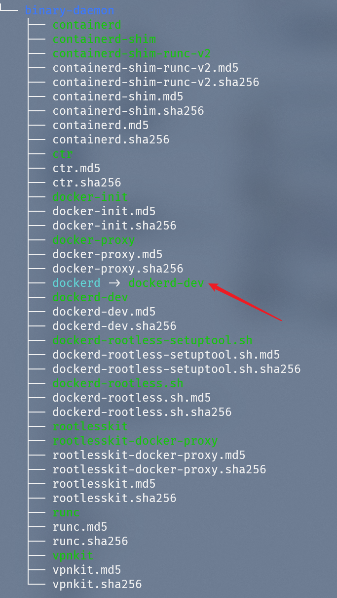

# 拉取和编译 Docker-CE

> Tips: 下面操作均在 [开篇：搞定 Go 开发环境](https://blog.csdn.net/qq_17004327/article/details/116248428) 中创建的 Linux 虚拟机中进行

## Docker-CE 的 cli 和 engine

Docker-CE 的仓库在 20.10 版本后会被归档不再维护，原来的 Docker-CE 会被拆分成 [docker/cli](https://github.com/docker/cli) 和 [moby/moby](https://github.com/moby/moby) 两个项目。docker/cli 项目就是 Docker-CE 的命令行工具部分，moby/moby 仓库就是原来的 Docker Engine 部分。

我们选择最新的 [docker/cli](https://github.com/docker/cli) 和 [moby/moby](https://github.com/moby/moby) 源码来拉取编译。

## 使用 Gitee 加速代码拉取

使用下列代码拉取 docker/cli 和 moby/moby 的 github 的仓库

```shell
git clone https://github.com/docker/cli.git
git clone https://github.com/moby/moby.git
```

如果处在比较好的网络环境下 clone github 的仓库十分方便，但在国内往往没有这样的网络环境，这时候我们可以考虑 Gitee 来加速 Github 仓库的拉取。下面展示使用 Gitee 加速 [docker/docker-ce](https://github.com/docker/docker-ce) 仓库的拉取。加速拉取  [docker/cli](https://github.com/docker/cli) 和 [moby/moby](https://github.com/moby/moby) 的方法同理。


通过上图 Copy 出的地址来进行 Clone 就能很享受极速的 clone 体验。


## 编译环境准备

docker/cli 和 moby/moby 的默认编译工具都需要依赖 Docker，这样的话我们需要先安装 Docker

### 安装 Docker

按顺序执行下列命令，就能够给简单的安装好 docker

```shell
sudo apt-get remove docker docker-engine docker.io containerd runc

sudo apt-get update

sudo apt-get install -y  apt-transport-https ca-certificates  curl gnupg lsb-release

curl -fsSL https://download.docker.com/linux/ubuntu/gpg | sudo gpg --dearmor -o /usr/share/keyrings/docker-archive-keyring.gpg

echo \
"deb [arch=amd64 signed-by=/usr/share/keyrings/docker-archive-keyring.gpg] https://download.docker.com/linux/ubuntu \
$(lsb_release -cs) stable" | sudo tee /etc/apt/sources.list.d/docker.list > /dev/null


sudo apt-get update

sudo apt-get install -y docker-ce docker-ce-cli containerd.io
```

### 选择分支

这里选择 20.10 的分支

```shell
cd cli
git chekout 20.10
```

```shell
cd moby
git checkout 20.10
```

## 编译 cli

cli 编译很简单在 cli 代码目录下执行下面命令

```shell
sudo su
make -f docker.Makefile binary
```

等待命令执行完成，就能在 `./build/` 目录下找到新鲜出炉的 docker 二进制文件


然后执行使用该文件执行 `./docker version`


cli 编译完成

## 编译 engine

engine 编译也很简单，在 moby 代码目录下执行下面命令

```shell
sudo su
make binary
```

然后在 `bundles/binary-daemon` 目录下就能找到 `dockerd`



接着我们需要执行 `systemctl stop docker` 和 `systemctl stop docker.socket` 停止原来的 docker 服务。

然后在打包出来的目录下执行 `./dockerd` 运行新鲜的 dockerd。


dockerd 执行成功，正在监听客户端的输入。

然后运行 `docker ps` 命令看是否能够正常输出。


docker engine 也编译完成。

## Docker Hello World

接着使用新鲜的 docker cli 和 docker engine 运行一遍 Docker Hello World

维持上面的 dockerd 不变，进入到  cli/build 目录，分别执行下列命令
 
```shell
./docker pull alphine
./docker run alpine echo "hello from alpine"
```

下面是 dockerd 和 docker-cli 同框的界面

