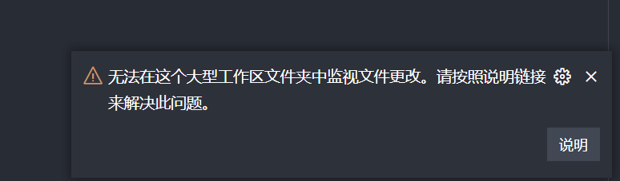
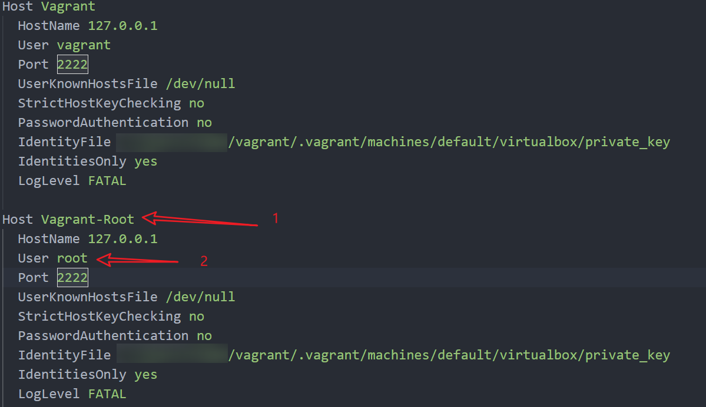
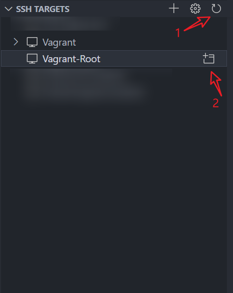
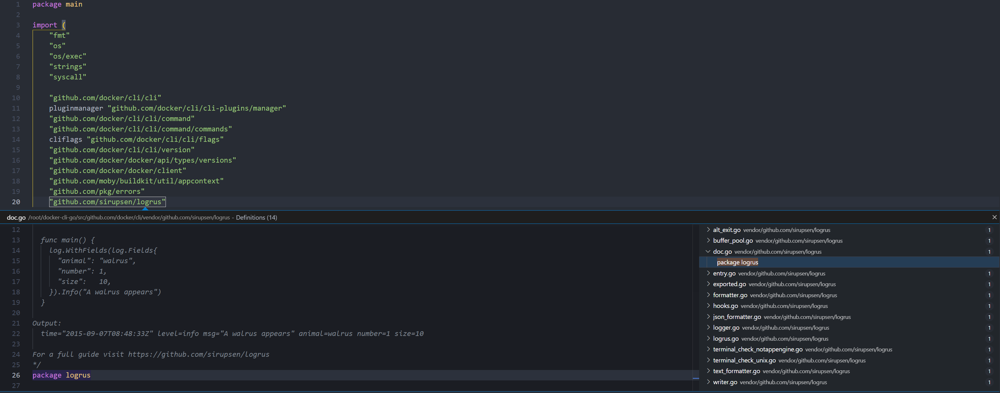
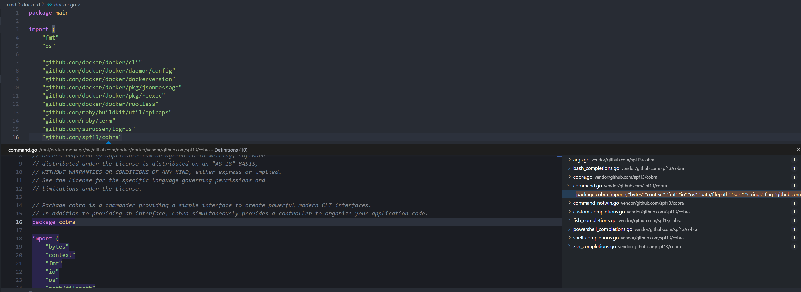
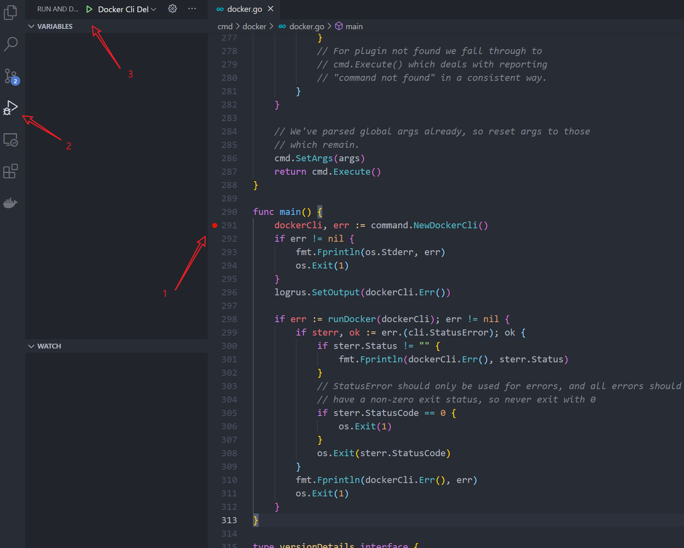
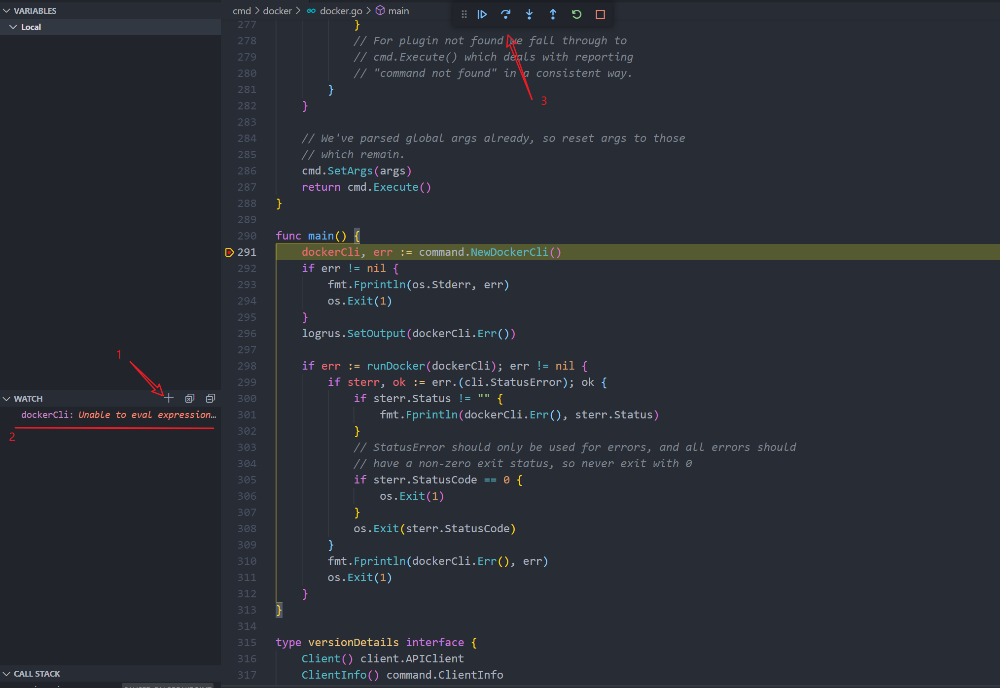
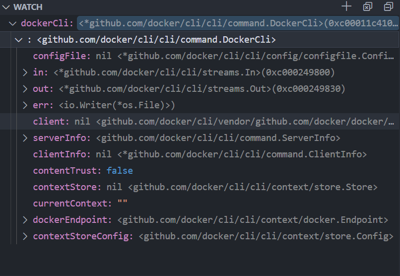
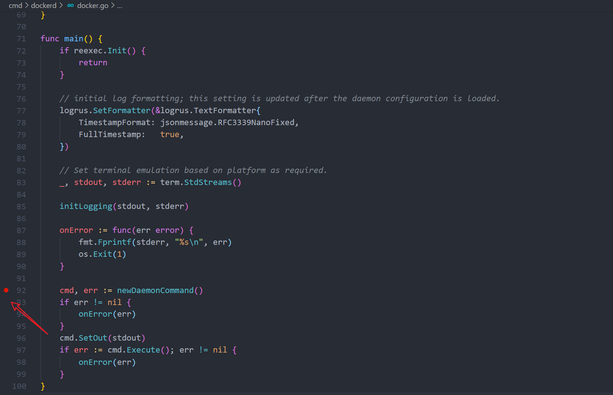
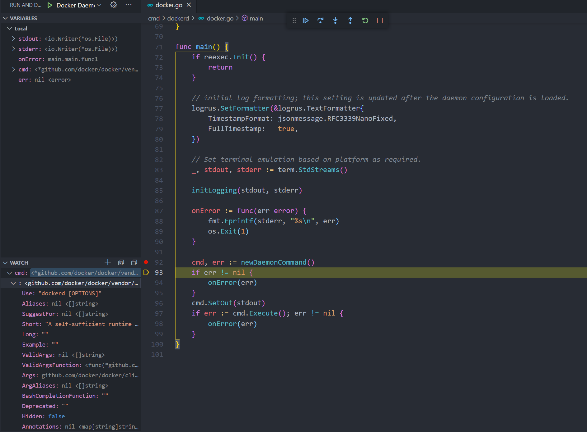

# 搭建 Docker CE 源码编写和调试环境

## 查看 Docker-CE 源码

当我们首次打开源码，在默认环境下 VSCode 会提示项目太大，不能有效追踪文件变化。



这时需要修改 Linux 的内核参数，使用下面的命令修改就可以

```shell
sudo su
echo 'fs.inotify.max_user_watches=524288' >> /etc/sysctl.conf 
sysctl -p
```

## 使用 root 用户登录 Vscode Remote Dev

由于 Docker 需要使用内核的功能，engine 需要使用 root 用于运行，而之前在 [开篇：搞定 Go 开发环境](https://blog.csdn.net/qq_17004327/article/details/116248428) 中创建的虚拟机环境默认是不允许 root 账户远程登录的。需要对虚拟机的 `/etc/sshd_config` 做修改。增加 `PermitRootLogin yes` 的选项。为了方便，root 用户公用 vagrant 用户的密钥。然后重启  sshd 服务器。按顺序执行下面的命令即可：

```shell
sudo su

echo 'PermitRootLogin yes' >> /etc/sshd_config

cp /home/vagrant/.ssh/authorized_keys /root/.ssh/


systemctl restart sshd
```

然后 ssh_config 文件也需要修改， vagrant 目录下执行 `vagrant ssh-config > ssh-config` 输出的文件复制一份。然后对 `Host` 和 `user` 做修改，如下所示：




然后刷新 vscode 的远程列表，登录新添加的 Vagrant-Root




后续都会在 root 用户下进行开发调试。

> Tips: 生产环境下应谨慎使用 root 用户，这是虚拟机开发环境，使用 root 用户能够避免走一些权限方面的坑。
## 设置开发环境

官方的 docker/cli 和 moby/moby 的开发环境都是通过容器提供的。由于已经使用了虚拟机，不希望再连接到容器中再进行开发，这里会尝试在虚拟机中直接设置开发环境。再由于 docker 开发时间比较久远，没有使用 go module 来进行依赖管理，这就导致了需要使用原始的 GOPATH 进行管理，所以我们需要对开发环境设置一番。

### 设置 docker/cli 开发环境

1. 执行下面命令在 /root 目录下创建一个用于放置 cli 源码的 GOPATH目录。

```shell
mkdir -p /root/docker-cli-go/src/github.com/docker
```

2. 将 cli 的源码软链接到 cli 的 GOPATH 目录下。

```shell
ln -s /Code/cli /root/docker-cli-go/src/github.com/docker/cli
```

使用命令 `code /root/docker-cli-go/src/github.com/docker/cli` 使用 vscode 打开 cli 的源码 

然后还需要为这个工作空间设置单独的变量，执行下面命令即可

```shell
mkdir -p /root/docker-cli-go/src/github.com/docker/cli/.vscode

echo '{
    "go.gopath": "/root/docker-cli-go",
    "go.toolsGopath": "/root/go",
    "go.toolsEnvVars": {
        "GO111MODULE": "auto"
    },
    "editor.links": false,
}' > /root/docker-cli-go/src/github.com/docker/cli/.vscode/settings.json
```

检测环境是否设置成功的方法是，打开一个代码文件，如:'./cli/docker/docker.go'，然后使用 `ctrk+鼠标左键` 能够正常查询引用代表环境设置正确。




### 设置 moby/moby 开发环境

和 docker/cli 类似，也需要为 moby/moby创建相应的 GOPATH 并将源码链接到 GOPATH 中，执行下列命令即可

```shell
mkdir -p /root/docker-moby-go/src/github.com/docker

ln -s /Code/moby /root/docker-moby-go/src/github.com/docker/docker
```

同理用 vscode 打开目录 `/root/docker-moby-go/src/github.com/docker/docker`，

设置工作空间参数

```shell
mkdir -p /root/docker-moby-go/src/github.com/docker/docker/.vscode

echo '{
    "go.gopath": "/root/docker-moby-go",
    "go.toolsGopath": "/root/go",
    "go.toolsEnvVars": {
        "GO111MODULE": "auto"
    },
    "editor.links": false,
}
' > /root/docker-moby-go/src/github.com/docker/docker/.vscode/settings.json
```

同理，我们也要打开一个文件（这里选择的是 `./cmd/docker/docker.go`）看能否正确的跳转。



## 开始 DEBUG 模式

进行一个软件的开发怎么能少得了 DEBUG 模式呢，通过 DEBUG 模式打断点，添加 WATCHER 的方式能够轻易的观察软件运行过程中的数据变化，接下来为 docker/cli 和 moby/moby 打下第一个断点正式开始 Docker 源码的学习。

### docker/cli 打下第一个断点

首先需要给 vscode 增加一个 DEBUG 配置，使用下面命令即可创建一个针对 `docker ps` 命令的 DEBUG 配置

```shell
echo '{
    // Use IntelliSense to learn about possible attributes.
    // Hover to view descriptions of existing attributes.
    // For more information, visit: https://go.microsoft.com/fwlink/?linkid=830387
    "version": "0.2.0",
    "configurations": [
        {
            "name": "Docker Cli Debug",
            "type": "go",
            "request": "launch",
            "mode": "auto",
            "program": "${workspaceFolder}/cmd/docker/docker.go",
            "args": ["ps"]
        }
    ]
}' > ./.vscode/launch.json
```

然后我们在 `./cmd/docker/docker.go` 文件打上断点，然后运行 DEBUG 模式，如下图所示



接着我们需要在 WATCH 栏上添加一个想要观察的变量，如 `dockerCli`，然后点击 `step over`



完成 dockerCli 语句赋值之后可以看到 WATCH 栏中的 dockerCli 有了一个值。



这样我们就完成了 docker/cli 的第一个断点调试。

### moby/moby 打下第一个断点

moby/moby 依赖较多的 lib，需要安装很多的 apt 包，这时候可以选择运行下面命令将官方源替换为清华的源

```shell
echo '
# 默认注释了源码镜像以提高 apt update 速度，如有需要可自行取消注释
deb https://mirrors.tuna.tsinghua.edu.cn/ubuntu/ focal main restricted universe multiverse
# deb-src https://mirrors.tuna.tsinghua.edu.cn/ubuntu/ focal main restricted universe multiverse
deb https://mirrors.tuna.tsinghua.edu.cn/ubuntu/ focal-updates main restricted universe multiverse
# deb-src https://mirrors.tuna.tsinghua.edu.cn/ubuntu/ focal-updates main restricted universe multiverse
deb https://mirrors.tuna.tsinghua.edu.cn/ubuntu/ focal-backports main restricted universe multiverse
# deb-src https://mirrors.tuna.tsinghua.edu.cn/ubuntu/ focal-backports main restricted universe multiverse
deb https://mirrors.tuna.tsinghua.edu.cn/ubuntu/ focal-security main restricted universe multiverse
# deb-src https://mirrors.tuna.tsinghua.edu.cn/ubuntu/ focal-security main restricted universe multiverse

# 预发布软件源，不建议启用
# deb https://mirrors.tuna.tsinghua.edu.cn/ubuntu/ focal-proposed main restricted universe multiverse
# deb-src https://mirrors.tuna.tsinghua.edu.cn/ubuntu/ focal-proposed main restricted universe multiverse
' > /etc/apt/sources.list
```

接着就是安装一系列的包

```
apt-get update && apt-get install -y  build-essential curl cmake gcc git libapparmor-dev libbtrfs-dev libdevmapper-dev libseccomp-dev ca-certificates e2fsprogs iptables pkg-config pigz procps xfsprogs xz-utils aufs-tools vim-common
```


和 docker/cli 一样我们需要为 moby/moby 增加一个针对 `dockerd` 的 DEBUG 配置

```shell
echo '{
    // Use IntelliSense to learn about possible attributes.
    // Hover to view descriptions of existing attributes.
    // For more information, visit: https://go.microsoft.com/fwlink/?linkid=830387
    "version": "0.2.0",
    "configurations": [
        {
            "name": "Docker Daemon Debug",
            "type": "go",
            "request": "launch",
            "mode": "auto",
            "program": "${workspaceFolder}/cmd/dockerd/",
        }
    ]
}' > ./.vscode/launch.json
```

然后为在 `./cmd/dockerd/docker.go` 文件里打上断点



运行 DEBUG 配置后能够正常观察变量

